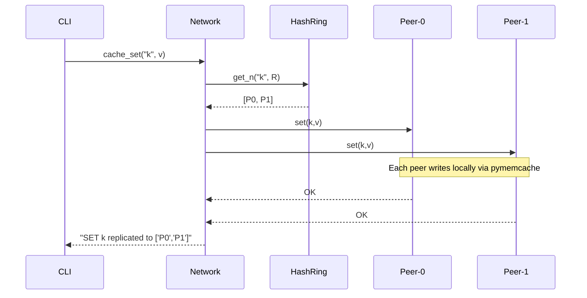

# Peercache Architecture

```
                ┌────────────────────────────┐
                │          Typer CLI         │
                │ main.py (peer/network/…)   │
                └────────────┬───────────────┘
                             │
                             ▼
           ┌──────────────────────────────────────┐
           │            Parser Layer              │
           │  • Peer      • Network      • Registry│
           └───────┬────────────┬────────────┬─────┘
                   │            │            │
                   ▼            ▼            ▼
        ┌───────────────┐ ┌──────────────┐ ┌──────────────────┐
        │  Memcached    │ │  Consistent  │ │   Settings (pyd) │
        │   Daemon      │ │  Hash Ring   │ │   config loader  │
        └───────────────┘ └──────────────┘ └──────────────────┘
                   ▲            │
                   │            │
                   └──── Stats & Benchmarks (testing/benchmark.py)
```

## 1. Core Concepts

| Concept                | File                          | Responsibility                                                                                                         |
| ---------------------- | ----------------------------- | ---------------------------------------------------------------------------------------------------------------------- |
| **Peer**               | `peercache/parser/peer.py`    | Starts/stops one memcached daemon; wraps a *thread‑local* `pymemcache.Client`. Persists metadata (PID, port).          |
| **Network**            | `peercache/parser/network.py` | Holds a set of peers plus replication/vnode settings. Implements `cache_set`/`cache_get` using **consistent hashing**. |
| **ConsistentHashRing** | `peercache/core/hashing.py`   | Pure‑python ring – O(log N) lookup, deterministic 32‑bit hashes, supports V virtual nodes.                             |
| **NetworkManager**     | `peercache/parser/manager.py` | CRUD for multiple networks; serialised into `state/network.json`.                                                      |
| **Benchmark harness**  | `testing/benchmark.py`        | Spins up peers, executes workload matrix, aggregates stats, emits JSON & PNGs.                                         |

## 2. Data & Persistence Layout

```
state/
├── peer/              ← one JSON per running peer + registry.json
│   └── p0.json        {id, port, pid}
├── network/           ← one JSON per network
│   └── demo.json      {name, peers, replication, vnodes}
└── stats/             ← historical benchmark artefacts
```

## 3. Connection‑Reuse Strategy

Each (thread‑id, port) tuple is cached via `functools.lru_cache`, so a workload with 16 threads talking to 8 ports opens **≤128 sockets total** instead of thousands. When a peer stops we call `cache_clear()` to drop stale connections.

## 4. Failure Behaviour

* **Peer crash** – next `get()`/`set()` raises; caller may retry on alternate replicas.
* **Ring empty** – `Network.cache_*` returns “No peers available.” to avoid tracebacks.
* **FD exhaustion** – handled at OS layer; benchmark prints the stack so user can tune `workers`.

## 5. Extensibility Ideas

* Switch memcached for **Redis** or **DragonflyDB** by swapping the `Peer` wrapper.
* Implement **gossip‑based membership** so peers auto‑discover.
* Add **Prometheus exporter** for live dashboards.

## 6. Sequence Diagram (set path)



---

*Generated 2025‑06‑07 via ChatGPT o3.*
